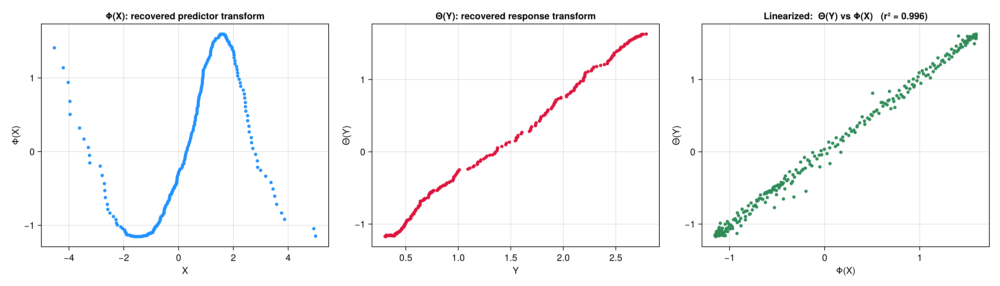
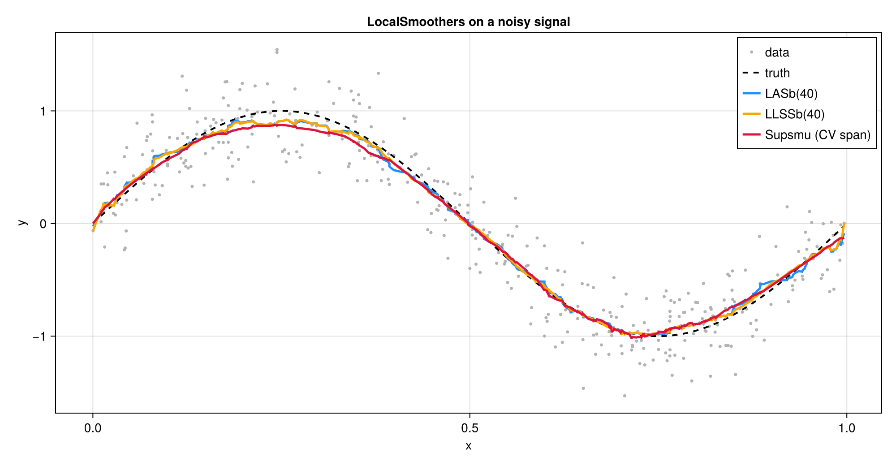

# AlternatingConditionalExpectations.jl


[](https://github.com/NilsWildt/AlternatingConditionalExpectations.jl/actions/workflows/CI.yml)
[](https://codecov.io/github/NilsWildt/AlternatingConditionalExpectations.jl?branch=master)

A Julia implementation of **Alternating Conditional Expectations** (ACE;
Breiman & Friedman, 1985) for nonparametric regression. ACE estimates optimal
transformations `Φⱼ(Xⱼ)` and `Θ(Y)` such that

```
Θ(Y) ≈ Σⱼ Φⱼ(Xⱼ)
```

by an iterative backfitting loop in which each conditional expectation is
estimated with a local smoother from
[LocalSmoothers.jl](https://github.com/NilsWildt/LocalSmoothers.jl).

## What it does

Given `Y = exp(sin X)`, ACE recovers the nonlinear predictor transform
`Φ(X) ≈ sin(X)` and response transform `Θ(Y) ≈ log(Y)` that together linearize
the relationship (right panel):



## Installation

ACE depends on two unregistered packages, so add them first:

```julia
using Pkg
Pkg.add(url = "https://github.com/NilsWildt/SimpleKernelregression.jl")
Pkg.add(url = "https://github.com/NilsWildt/LocalSmoothers.jl")
Pkg.add(url = "https://github.com/NilsWildt/AlternatingConditionalExpectations.jl")
```

## Usage

```julia
using AlternatingConditionalExpectations

# 200 samples of a noisy bivariate relationship
X, Y = generate_bivariate_data(Float64, 200, 0.1, 1.0, 42)

# fit ACE with a boundary-corrected local-average smoother (window 10)
model = ace(X, Y; smoother = LASb(10))
model.tx        # φ, the predictor transforms
model.ty        # θ, the response transform
model.rsq       # coefficient of determination
predict(model, X)                     # transformed-response fit for new data

# AVAS (Tibshirani 1988): variance-stabilizing variant, monotone response
avas(X, Y; smoother = LASb(10))

# constrain individual variables
ace(X, Y; smoother = LASb(10), xtransforms = Monotone(LASb(10)))

# dark-theme diagnostic grid + convergence history (load any Makie backend first)
using CairoMakie
plot_ace_results(model; savepath = "ace_result.png")
```

`ace_run(ACEsim(...))` and `avas_run(...)` remain as thin compatibility shims.

Per-variable transforms: `Smooth` (default), `Monotone` (isotonic),
`LinearFit`, `Categorical`, and `Periodic`.

The conditional expectations are estimated with any
[LocalSmoothers.jl](https://github.com/NilsWildt/LocalSmoothers.jl) smoother,
including Friedman's variable-span super smoother (`Supsmu`):



## What's in the package

- **Algorithms** — `ace` / `avas` (backfitting), `predict`, `stoch_normalize`, `ε²`, conditional
  expectations, bivariate/multivariate data generation.
- **Smoothers** — re-exported from `LocalSmoothers`: `LAS`, `LASb`, `LLSS`,
  `LLSSb`, `FRSS`, `Kernelsmooth`, `NWKernelsmooth`, plus the kernel types.
- **Benchmarks** — `BenchmarkFunction`, `f_b1`…`f_b4`, `f_toy` with samplers.
- **Error metrics** — `MAE`, `nMAE`, `RMSE`, `UFV`, `pErr`, `AARD`.
- **Plotting** — Makie-based (load `CairoMakie` or any Makie backend):
  `plot_ace_results` builds a dark diagnostic grid for an `ACEres`;
  `benchmark_ace_plot` overlays reference transform curves. Provided via a
  package extension, so Makie stays opt-in and the core package is light.

## Development

```bash
git clone https://github.com/NilsWildt/AlternatingConditionalExpectations.jl
cd AlternatingConditionalExpectations.jl
julia --project=. -e 'import Pkg; Pkg.test()'
```

Runnable demos live in `scripts/` and write PNGs to `output/`:

```bash
julia --project=. scripts/demo2d.jl
```

To regenerate the figures embedded in this README (`assets/`), add the plotting
backend once, then run the generator:

```bash
julia --project=. -e 'import Pkg; Pkg.add(["CairoMakie", "Makie"])'
julia --project=. scripts/make_readme_plots.jl
```

## Related work

This package implements the **ACE** algorithm of Breiman & Friedman (1985) and
the variance-stabilizing **AVAS** variant of Tibshirani (1988). Both estimate
nonlinear transformations of the response and predictors so that an additive
model fits as tightly as possible. They differ in that AVAS additionally
constrains the response transform to stabilize the residual variance, which
tends to give more sensible transforms when the signal-to-noise ratio is low —
the regime where plain ACE is known to misbehave.

The R package **acepack** (Spector, Friedman, Tibshirani, Lumley, Garbett, et
al.) is the long-standing reference implementation, written in Fortran. Its
source was an invaluable guide while porting the AVAS variance-stabilization
step (`ctsub`) and Friedman's variable-span super smoother (`Supsmu`) to Julia,
and was used to validate their output. A readable introduction to both methods
is Chapter 16 of Frank Harrell's *Regression Modeling Strategies* (Springer).

### References

- Breiman, L., & Friedman, J. H. (1985). Estimating optimal transformations for
  multiple regression and correlation. *Journal of the American Statistical
  Association*, 80(391), 580–598.
  doi:[10.1080/01621459.1985.10478157](https://doi.org/10.1080/01621459.1985.10478157)
- Tibshirani, R. (1988). Estimating transformations for regression via
  additivity and variance stabilization. *Journal of the American Statistical
  Association*, 83(402), 394–405.
  doi:[10.1080/01621459.1988.10478610](https://doi.org/10.1080/01621459.1988.10478610)
- Spector, P., Friedman, J., Tibshirani, R., Lumley, T., Garbett, S., Baron, J.,
  Klar, B., & Chasalow, S. (2025). *acepack: ACE and AVAS for Selecting Multiple
  Regression Transformations*. R package version 1.6.3.
  doi:[10.32614/CRAN.package.acepack](https://doi.org/10.32614/CRAN.package.acepack)
- Harrell, F. E. (2015). *Regression Modeling Strategies* (2nd ed., Ch. 16).
  Springer.

## License

MIT — see [LICENSE.md](LICENSE.md).
